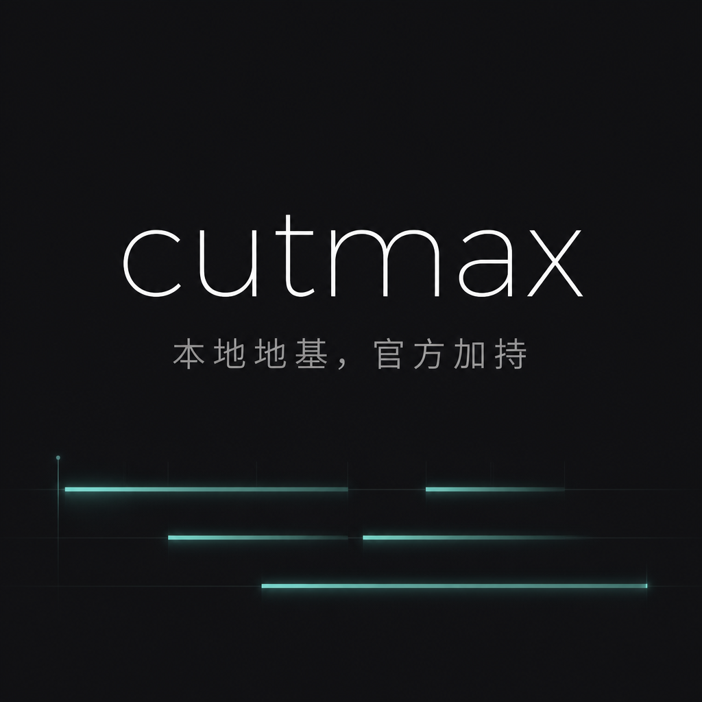

<div align="center">


<br/>

[](LICENSE)
[](https://github.com/WillNam/cutmax)
[](skills/)
[](platforms/)

</div>

---

<div align="center">

**本地地基，官方加持。给 Agent 用的剪辑与素材技能包。**

为 [Claude Code](https://claude.ai/code) / [Codex](https://openai.com/codex) / [Cursor](https://cursor.sh) 设计的视频制作技能集合。  
默认能力跑在你的电脑上；需要更强成片时，正式接入官方平台——不是抵制，是为了做得更好。

</div>

---

## 能做什么


<br/>


<br/>

| 场景 | 技能 | 工具 |
|------|------|------|
| 照片 → 手绘动效成片 | `story-to-handdrawn-video` | Remotion + ffmpeg + Pillow |
| 脚本 → 可拍摄分镜 | `script-to-shootable-storyboard` | Pillow + ffmpeg |
| Manim 数学动画视频 | `manim-video` | Manim |
| 短视频脚本 + 运镜 | `self-media-short-video` + `video-shotcraft` | — |
| 封面设计 | `gbro-cover-design` + `xhs-visual-director-skill` | Pillow / ImageMagick |
| 视频裁剪 + 混剪 | `baocut` | BaoCut |
| 内容分发 & 排期 | `video-publisher` + `self-media-content-delivery` | — |
| 即梦 AI 视频生成 | `platforms/seedance2` | Seedance 官方 API |
| ChatCut 专业剪辑 | `platforms/chatcut` | ChatCut 官方 |
| Pireel 竖版成片 | `platforms/pireel` | Pireel 官方 |

---

## 结构

```
cutmax/
├── skills/          # 本地地基 — ffmpeg · Pillow · Remotion · BaoCut
│   ├── local-video-studio/        ← 主控技能，从这里开始
│   ├── story-to-handdrawn-video/  ← 照片→手绘动效
│   ├── baocut/                    ← 智能剪辑
│   ├── manim-video/               ← 数学动画
│   ├── video-shotcraft/           ← 运镜设计
│   ├── self-media-short-video/    ← 短视频脚本
│   └── ...（共 19 个技能）
│
├── platforms/       # 官方加持 — 需平台账号，计费前确认
│   ├── seedance2/            ← 即梦视频生成
│   ├── chatcut/              ← ChatCut 专业剪辑
│   ├── pireel/               ← Pireel 竖版成片
│   └── seedance-and-prompts/ ← 即梦系 Prompt Pack
│
├── tools/           # 本地工具源码
│   └── story-to-handdrawn-video/  ← Remotion 项目
│
├── rules/           # Agent 规则
│   └── stock-broll-workflow.md    ← Pexels B-roll 自动工作流
│
├── scripts/         # 安装助手
│   ├── link-skills.sh
│   └── link-platforms.sh
│
└── brand/           # 品牌资产
```

---

## 快速开始

### 1. 克隆

```bash
git clone https://github.com/WillNam/cutmax.git
cd cutmax
```

### 2. 链接技能到 Codex

```bash
# 本地技能（免费，无需账号）
bash scripts/link-skills.sh

# 官方平台技能（需对应账号）
bash scripts/link-platforms.sh
```

### 3. 触发 Agent

在 Claude Code / Codex 中直接说：

```
/local-video-studio  →  进入视频工作室主控
/story-to-handdrawn  →  把一张照片做成手绘动效成片
/baocut              →  混剪 + 裁剪
/video-shotcraft     →  运镜设计
```

---

## 技能全览

### 本地地基（`skills/`）

| 技能 | 说明 | 依赖 |
|------|------|------|
| `local-video-studio` | 主控中枢，路由所有视频任务 | ffmpeg · Pillow |
| `story-to-handdrawn-video` | 照片 → 手在画 → 线稿 → 水彩成片 | Remotion · ffmpeg · Pillow |
| `baocut` | 智能混剪、裁剪、字幕 | BaoCut |
| `manim-video` | 数学 / 数据可视化动画 | Manim · ffmpeg |
| `video-shotcraft` | 镜头语言设计 + 分镜 | — |
| `script-to-shootable-storyboard` | 脚本 → 可执行拍摄分镜 | Pillow |
| `self-media-short-video` | 短视频脚本与结构 | — |
| `self-media-content-brief` | 内容 Brief 生成 | — |
| `self-media-content-delivery` | 多平台分发排期 | — |
| `self-media-content-workflow` | 从选题到成片全流程 | — |
| `self-media-platform-copywriting` | 平台文案（小红书 / 抖音 / 微信） | — |
| `gbro-cover-design` | 封面设计 | Pillow / ImageMagick |
| `xhs-visual-director-skill` | 小红书视觉风格 | — |
| `guizang-social-card-skill` | 社交卡片设计 | — |
| `learning-map-infographic` | 学习地图信息图 | — |
| `female-outfit-director` | 穿搭选品拍摄指导 | — |
| `video-publisher` | 发布工具集成 | — |
| `dr-chan-video-production` | 医疗健康视频制作规范 | — |
| `conan-digital-human` | 数字人视频工作流 | — |

### 官方加持（`platforms/`）

| 平台 | 说明 | 计费 |
|------|------|------|
| `seedance2` | 即梦 AI 视频生成，文/图生视频 | 按量 |
| `chatcut` | ChatCut AI 剪辑助手 | 订阅 |
| `pireel` | Pireel 竖版一键成片 | 订阅 |
| `seedance-and-prompts` | 即梦系 Prompt Pack，不调 API 可纯用提示词 | 免费提示词 |

---

## 关于平台集成

cutmax 不抵制付费平台。  
本地能力跑稳了，平台让它飞得更高。

规则只有一条：**计费前说清楚。** Agent 使用平台能力时，会先列出预计消耗并等你确认，不会静默扣费。

没有账号？技能自动回退到本地方案或只输出 Prompt / 分镜，不会静默失败。

---

## 贡献

欢迎 PR。新技能请按 `skills/local-video-studio/` 的 `SKILL.md` 格式提交。  
平台集成请放 `platforms/` 并在 `CATALOG.md` 登记。

---

<div align="center">



<br/>

**cutmax** · MIT · [WillNam/cutmax](https://github.com/WillNam/cutmax)

</div>
